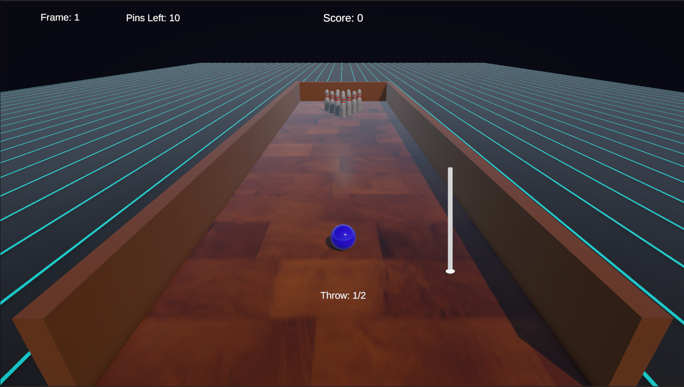

# 3D Bowling

3D игра в боулинг, разработанная на C# и Unity.

## Описание

В игре реализована классическая система игры в боулинг.
Игрок выполняет до двух бросков за фрейм, всего 10 фреймов.

## Реализовано

- физика мяча;
- взаимодействие мяча с кеглями;
- система из 10 фреймов;
- до 2 бросков за фрейм;
- Strike;
- Spare;
- подсчёт очков;
- отображение текущего фрейма;
- отображение количества оставшихся кеглей;
- пользовательский интерфейс.

## Технологии

- C#
- Unity
- 3D Physics
- Unity UI

## Скриншот

